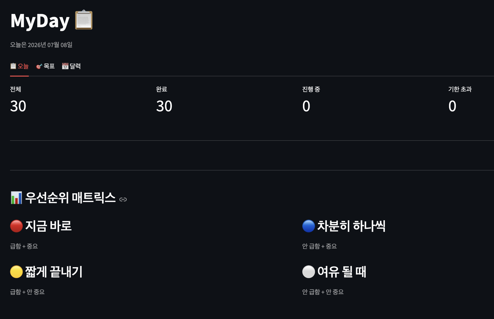
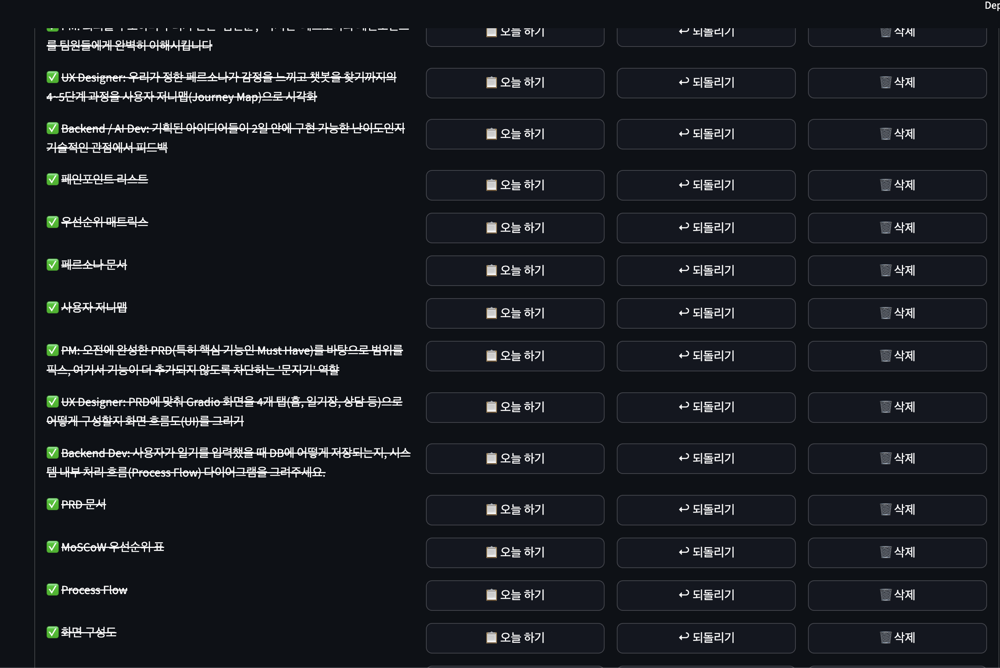

# MyDay 📋

> 무엇을 해야 할지 모르는 사람이, 스스로 질문하며 답을 찾도록 돕는 할 일 관리 앱

## 이 앱을 만든 이유

할 일이 막막할 때 문제는 "시간이 없어서"가 아니라 **"뭘 해야 할지 정리가 안 돼서"** 인 경우가 많습니다.
MyDay는 AI가 답을 대신 주지 않습니다. 대신 스스로 정리하고 우선순위를 세우도록 도와서,
"스스로 해결하는 역량"이 자라게 하는 것을 목표로 합니다.

## 주요 기능

- 📋 **오늘** — 칸반 보드(To Do → Doing → Done), 동시 진행 개수 제한(WIP), 급함·중요 우선순위 정렬, 가용시간 대비 할 일 시간 계산
- 🎯 **목표** — 장기 목표 관리 + 체크리스트 + 진행률(%), 항목을 "오늘 할 일"로 보내기
- 📅 **달력** — 완료한 일을 날짜별로 확인
- 🗂 **템플릿** — 반복되는 체크리스트를 저장해두고 목표 만들 때 재사용

## 화면

**우선순위 매트릭스** (초기 버전 — 급함/중요 4분면으로 할 일을 분류)



**할 일 목록** — 기획 업무를 실제로 관리하며 사용한 모습



> 현재 버전은 4분면 대신 **칸반 보드(To Do → Doing → Done)** 로 개편되었습니다.
> 변경 이유는 [의사결정 기록](docs/00-decisions.md)에 정리돼 있습니다.

## 실행 방법

```bash
# 1. 가상환경 만들기 & 켜기
python3 -m venv venv
source venv/bin/activate        # (Windows: venv\Scripts\activate)

# 2. 라이브러리 설치
pip install -r requirements.txt

# 3. 앱 실행
streamlit run app.py
```

브라우저에서 자동으로 열립니다 (기본 http://localhost:8501).

## 기술 스택

- Python 3
- [Streamlit](https://streamlit.io/) — UI
- 데이터는 로컬 JSON 파일에 저장 (`tasks.json`, `goals.json`, `templates.json`)

## 프로젝트 구조

```
.
├── app.py            # 앱 본체 (Streamlit)
├── requirements.txt  # 실행에 필요한 라이브러리
├── docs/             # 기획 문서 (PRD, 로드맵, 의사결정 기록)
├── journal/          # 개발 일지 — 그날 배운 것과 막힌 것 기록
├── notes/            # 학습 정리 (Git 등)
└── assets/           # 스크린샷
```

## 기획 문서

프로젝트를 어떻게 설계했는지는 [`docs/`](docs/) 폴더에 정리돼 있습니다.

- [PRD (제품 정의)](docs/01-prd.md)
- [개발 로드맵](docs/02-roadmap.md)
- [의사결정 기록](docs/00-decisions.md)
- [변경 이력](docs/05-changelog.md)

## 개발 기록

만들면서 배운 것과 막혔던 지점을 [`journal/`](journal/)에 남기고 있습니다.

- [Day 1 (2026-06-19)](journal/2026-06-19.md) — Git/GitHub 첫 시작
- [Day 2 (2026-06-22)](journal/2026-06-22.md) — MyDay 프로젝트 착수
- [Git 기초 정리](notes/git-cheatsheet.md)
